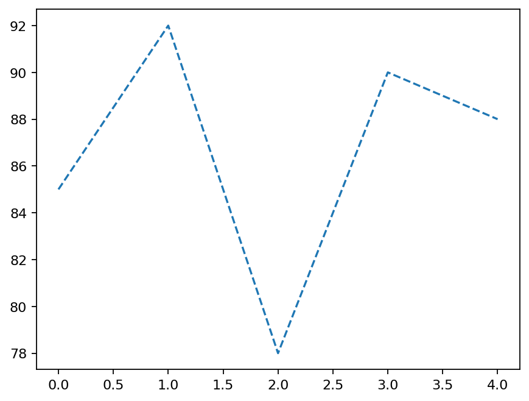

# Python 六级备考时的编程练习

这是准备中国电子学会 Python 六级时逐步积累的编程练习：短脚本、练习用数据文件，以及一些尚未整理成完整应用的尝试。这里的“六级”指 **Python 编程等级**，不是英语六级。

2026 年 6 月 22 日的 Python 六级证书材料已在个人档案中另行保存。**本仓库展示的是学习过程，不是考试答卷，也不能单独作为证书真伪的核验证明。**

*一个具体练习：`study_with_open.py` 读取 `score.txt`，计算平均值，再画出五个样例数值。图中数值不是考试成绩。*

## 按主题看

| 主题 | 文件 | 内容 |
| --- | --- | --- |
| 基础语法与对象 | [`class_test_6.py`](class_test_6.py)、[`sm_1.py`](sm_1.py) | 类、方法及语法练习 |
| 数组与数值 | [`study_numpy.py`](study_numpy.py)、[`Study_NumPy_2.py`](Study_NumPy_2.py) | NumPy 数组与数列 |
| 文件与绘图 | [`study_with_open.py`](study_with_open.py)、[`score.txt`](score.txt)、[`study_matpoltlib.py`](study_matpoltlib.py) | 文本读取、平均值及 Matplotlib 图形 |
| 桌面界面 | [`study_tkinter.py`](study_tkinter.py)、[`TkinterAndSQLTest.py`](TkinterAndSQLTest.py) | Tkinter 按钮与界面练习 |
| 数据库 | [`sqlite3_study.py`](sqlite3_study.py)、[`study_sql_test_6_day.py`](study_sql_test_6_day.py) | SQLite 建表、查询与数据修改练习 |

这不是一个有统一入口的成品应用。各文件可以单独阅读；部分脚本是练习过程中的半成品，不能保证直接运行。

## 试运行一个小例子

安装 Python、NumPy 和 Matplotlib 后，在仓库目录运行 `python study_with_open.py`。它读取同目录的 `score.txt`，绘图会打开本机窗口。若只想看无需额外库的基础练习，可运行 `python class_test_6.py`。

上面的折线图已用仓库当前脚本及数据在本地复现；脚本输出的数组是 `[85 92 78 90 88]`，平均值为 `86.6`。这组数值仅用于代码练习。

SQLite 脚本可能修改同目录数据库；试验前请复制数据文件。仓库中的 `.db` 和 `.idea/` 是早期练习留下的文件，尚未整理为可复用示例；公开分享数据库内容前仍需核查。项目未附统一依赖清单、测试结果或开源许可。
